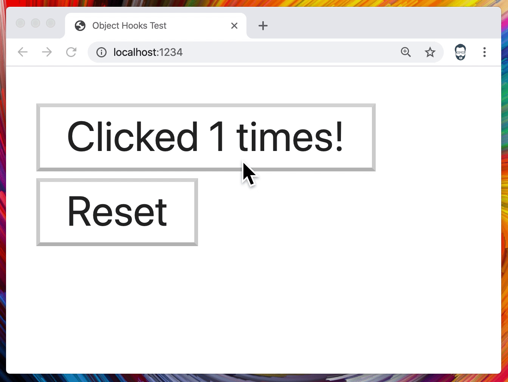
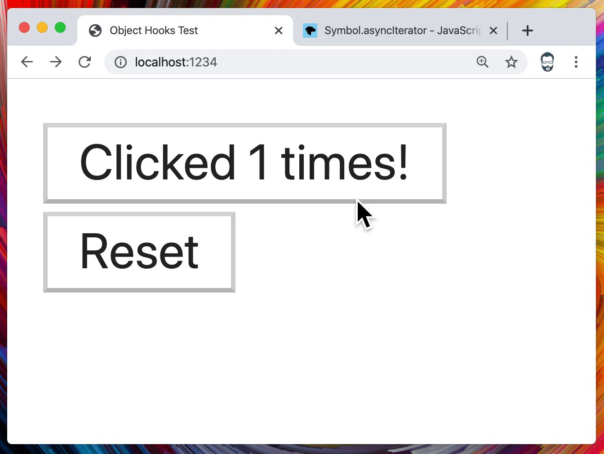

# Object Hooks

The repository is called Object Hooks, which belies its true [purpose](#purpose), but the compiled applications from this repo are a matching game for dogs breeds, and an IndexDB powered notebook!

## [🐕🐩.to](https://🐕🐩.to)


[](https://app.netlify.com/sites/object-hooks-test/deploys)

## [📔.to](https://📔.to)


# Purpose

The purpose of this repository is to develop and test a group of novel [React Hooks](https://reactjs.org/docs/hooks-intro.html), all of which revolve around mutable state. These hooks are:

1. [useObject](#useobject)
1. [useArray](#usearray)
1. [useInstance](#useinstance)
1. [useInstances](#useinstances)

The examples in this readme are simplified, but look in the source (you can start with the dog matching app's [Game.tsx](./packages/name-that-dog/src/components/Game.tsx)!) for more realistic usages. Lets get started!

# useObject

Takes a plain object or array and returns a tuple of a mutable [Proxy](https://developer.mozilla.org/en-US/docs/Web/JavaScript/Reference/Global_Objects/Proxy) of the first passed object or array, and a function to trigger it to reset to the next passed value:

```tsx
import React from 'react';

import { useObject } from '../hooks/useObject';

export const Counter: React.FC = () => {
  const [local, resetLocal] = useObject({
    count: 1,
  });

  return (
    <>
      <button
        onClick={() => {
          local.count++;
        }}
      >
        Clicked {local.count} times!
      </button>
      <button
        onClick={() => {
          resetLocal();
        }}
      >
        Reset
      </button>
    </>
  );
};
```



The Proxy object also implements the [AsyncIterable](https://developer.mozilla.org/en-US/docs/Web/JavaScript/Reference/Global_Objects/Symbol/asyncIterator) interface. This means you can use `await` in an async function to recieve the next state, _and_ you can use a `for await` loop in an async function to asynchronously iterate over future states. Here we add a trivial logger that logs the count. Pretty cool!

```tsx
import React, { useEffect } from 'react';

import { useObject } from '../hooks/useObject';

export const Counter: React.FC = () => {
  const [local, resetLocal] = useObject({
    count: 1,
  });

  const logCount = (count: number) => console.log(`Count is: ${count}`);

  const watchCount = async () => {
    logCount(local.count);

    for await (const { count } of local) {
      logCount(count);
    }
  };

  useEffect(() => {
    watchCount();
  }, [local]);

  return (
    <>
      <button
        onClick={() => {
          local.count++;
        }}
      >
        Clicked {local.count} times!
      </button>
      <button
        onClick={() => {
          resetLocal();
        }}
      >
        Reset
      </button>
    </>
  );
};
```


# useArray

You may be thinking: "What about arrays?" Those work too, so you can mutate and observe them as well! See the source for usage!

# useInstance

Now that we have mutable objects, it would be nice if they could do more than hold values. What if they could hold logic, and and type themselves in a way that we can extend them? Fot that, we'll need to use a class, and the `useInstance` hook. This example should look familiar, because its just the first counter example implemented with a class!

```tsx
import React from 'react';

import { useInstance } from '../hooks/useInstance';

class CounterLogic {
  count = 1;

  increment() {
    this.count++;
  }
}

export const Counter: React.FC = () => {
  const [counter, resetCounter] = useInstance(CounterLogic);

  return (
    <>
      <button
        onClick={() => {
          counter.increment();
        }}
      >
        Clicked {counter.count} times!
      </button>
      <button
        onClick={() => {
          resetCounter();
        }}
      >
        Reset
      </button>
    </>
  );
};
```



The instance of the class, like the object from `useObject`, is also an AsyncIterable of its updates. Here's the second logging example rewritten with the logging logic as its own class.

```tsx
import React, { useEffect } from 'react';

import { useInstance } from '../hooks/useInstance';

class CounterLogic {
  count = 1;

  increment() {
    this.count++;
  }
}

class CounterLogger {
  constructor(private logic: CounterLogic & AsyncIterable<CounterLogic>) {}

  log(count: number) {
    console.log(`Count is: ${count}`);
  }

  async watch() {
    this.log(this.logic.count);

    for await (const { count } of this.logic) {
      this.log(count);
    }
  }
}

export const Counter: React.FC = () => {
  const [counter, resetCounter] = useInstance(CounterLogic);
  const [logger, resetLogger] = useInstance(CounterLogger, counter);

  useEffect(() => {
    logger.watch();
  }, [logger]);

  return (
    <>
      <button
        onClick={() => {
          counter.increment();
        }}
      >
        Clicked {counter.count} times!
      </button>
      <button
        onClick={() => {
          resetCounter();
          resetLogger();
        }}
      >
        Reset
      </button>
    </>
  );
};
```


One additional thing to note about this example is that the constructors for these classes can take arguments. Just pass them as the remaining arguments to `useInstance`!

# useInstances

This one is a little experimental at the moment in terms of its return value, so I'll hold off on documenting it. The idea is "What if I wanted to make a collection of these instances"? For current useage, see the source!
